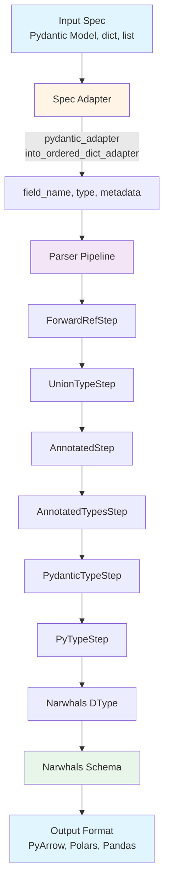

# Architecture

This page provides a deep dive into anyschema's internal design and architecture. Understanding these concepts will help you extend anyschema and troubleshoot issues.

## Overview

anyschema follows a pipeline architecture with two main components:

1. **Spec Adapters**: Convert input specifications into a normalized format
2. **Parser Pipeline**: Chain of parser steps that convert types to Narwhals dtypes



## Core Components

### Spec Adapters

Spec adapters are functions that convert various input formats into a unified representation: an iterable of `(field_name, field_type, metadata)` tuples. See the [API Reference](api-reference.md#spec-adapters) for detailed documentation.

#### `pydantic_adapter`

Extracts field information from Pydantic models:

```python
from pydantic import BaseModel, Field
from typing import Annotated
from anyschema.adapters import pydantic_adapter


class User(BaseModel):
    id: int
    name: Annotated[str, Field(max_length=100)]


for field_name, field_type, metadata in pydantic_adapter(User):
    print(f"{field_name}: {field_type}, metadata={metadata}")

# Output:
# id: <class 'int'>, metadata=()
# name: typing.Annotated[str, Field(max_length=100)], metadata=(FieldInfo(...),)
```

**Key responsibilities:**
- Extract field names from `model_fields`
- Extract field type annotations
- Extract metadata from Pydantic's `Field` constraints

#### `into_ordered_dict_adapter`

Handles Python dicts and lists of tuples:

```python
from anyschema.adapters import into_ordered_dict_adapter

# From dict
spec = {"id": int, "name": str}
for field_name, field_type, metadata in into_ordered_dict_adapter(spec):
    print(f"{field_name}: {field_type}")

# From list of tuples
spec = [("id", int), ("name", str)]
for field_name, field_type, metadata in into_ordered_dict_adapter(spec):
    print(f"{field_name}: {field_type}")
```

**Key responsibilities:**
- Convert dict/list to OrderedDict (preserves field order)
- Yield `(field_name, field_type, empty_metadata)` tuples

### Parser Pipeline

The `ParserPipeline` orchestrates multiple parser steps, trying each in sequence until one successfully handles the type. See the [API Reference](api-reference.md#parserpipeline) for detailed documentation.

```python
from anyschema.parsers import ParserPipeline, PyTypeStep

# Create a simple pipeline
pipeline = ParserPipeline(steps=[PyTypeStep()])

# Parse a type
dtype = pipeline.parse(int)
print(dtype)  # Int64
```

**Key methods:**
- `parse(input_type, metadata=(), strict=True)`: Try each parser until one succeeds

### Parser Steps

Each parser step is responsible for handling specific type patterns. Steps implement the `ParserStep` abstract base class.

#### 1. ForwardRefStep

**Purpose**: Resolves forward references to actual types.

**Handles**: `ForwardRef('ClassName')`

**Why it exists**: Forward references need to be resolved before any type inspection can happen.

```python
from typing import ForwardRef
from anyschema.parsers import ForwardRefStep, ParserPipeline, PyTypeStep

forward_ref_step = ForwardRefStep()
python_step = PyTypeStep()
pipeline = ParserPipeline([forward_ref_step, python_step])

forward_ref_step.pipeline = pipeline
python_step.pipeline = pipeline

# ForwardRef to int
ref = ForwardRef("int")
dtype = forward_ref_step.parse(ref)
print(dtype)  # Int64
```

**Order**: Must be first! Forward references must be resolved before any other parsing.

#### 2. UnionTypeStep

**Purpose**: Handles Union types, particularly `Optional[T]` (which is `Union[T, None]`).

**Handles**:
- `Union[T, None]`
- `T | None` (PEP 604 syntax)
- `Optional[T]`

**Why it exists**: Dataframe libraries typically don't have Union types. We extract the non-None type and let subsequent parsers handle it. The nullable information is preserved in the schema.

```python
from anyschema.parsers import UnionTypeStep, ParserPipeline, PyTypeStep

union_step = UnionTypeStep()
python_step = PyTypeStep()
pipeline = ParserPipeline([union_step, python_step])

union_step.pipeline = pipeline
python_step.pipeline = pipeline

# Parse Optional[int]
dtype = union_step.parse(int | None)
print(dtype)  # Int64 (nullable)
```

**Order**: Should be early in the pipeline. Extracting the real type early simplifies downstream parsers.

#### 3. AnnotatedStep

**Purpose**: Extracts types and metadata from `typing.Annotated`.

**Handles**: `Annotated[T, metadata1, metadata2, ...]`

**Why it exists**: Separates the base type from its constraints/metadata, allowing other parsers to process them independently.

```python
from typing import Annotated
from anyschema.parsers import AnnotatedStep, ParserPipeline, PyTypeStep

annotated_step = AnnotatedStep()
python_step = PyTypeStep()
pipeline = ParserPipeline([annotated_step, python_step])

annotated_step.pipeline = pipeline
python_step.pipeline = pipeline

# Parse Annotated[int, "some metadata"]
dtype = annotated_step.parse(Annotated[int, "some metadata"])
print(dtype)  # Int64
```

**Order**: Should come after UnionTypeStep but before type-specific parsers. This ensures metadata is extracted before type refinement.

#### 4. AnnotatedTypesStep

**Purpose**: Refines types based on constraint metadata (e.g., positive integers).

**Handles**: Types with `annotated_types` or Pydantic constraint metadata

**Why it exists**: Constraints like "positive integer" should map to unsigned integer types for better performance and correctness.

```python
from pydantic import PositiveInt
from anyschema import AnySchema


class Data(BaseModel):
    count: PositiveInt  # Becomes UInt64, not Int64


schema = AnySchema(spec=Data)
print(schema.to_arrow())
# count: uint64
```

**Order**: Must come after AnnotatedStep (to receive extracted metadata) but before PydanticTypeStep and PyTypeStep.

#### 5. PydanticTypeStep

**Purpose**: Handles Pydantic-specific types that don't have direct Python equivalents.

**Handles**: Pydantic types like `Json`, custom Pydantic types

**Why it exists**: Some Pydantic types need special handling that pure Python type inspection can't provide.

**Order**: Should come after metadata extraction but before the fallback PyTypeStep.

#### 6. PyTypeStep

**Purpose**: Handles basic Python types (the fallback parser).

**Handles**:
- Basic types: `int`, `float`, `str`, `bool`, `bytes`
- Temporal types: `date`, `datetime`, `time`, `timedelta`
- Container types: `list[T]`, `tuple[T, ...]`, `Sequence[T]`, `Iterable[T]`
- Other types: `Decimal`, `Enum`, `object`

**Why it exists**: This is the fundamental parser that handles all standard Python types.

```python
from anyschema.parsers import PyTypeStep

python_step = PyTypeStep()

print(python_step.parse(int))  # Int64
print(python_step.parse(str))  # String
print(python_step.parse(list[int]))  # List(Int64)
```

**Order**: Should be last! This is the fallback parser that handles standard types after all specialized parsers have had a chance.

## Parser Order and Rationale

The order of parsers is critical:

```python
steps = (
    ForwardRefStep(),  # 1. Resolve forward references first
    UnionTypeStep(),  # 2. Extract non-None types from Optional/Union
    AnnotatedStep(),  # 3. Extract metadata from Annotated
    AnnotatedTypesStep(),  # 4. Refine types based on metadata
    PydanticTypeStep(),  # 5. Handle Pydantic-specific types
    PyTypeStep(),  # 6. Fallback to basic Python types
)
```

**Why this order?**

1. **ForwardRefStep first**: Forward references must be resolved before any type inspection
2. **UnionTypeStep early**: Extracting the real type simplifies all downstream parsers
3. **AnnotatedStep early**: Metadata extraction should happen before type-specific logic
4. **AnnotatedTypesStep**: Refine types based on the extracted metadata
5. **PydanticTypeStep**: Handle Pydantic-specific types before falling back to Python types
6. **PyTypeStep last**: The catch-all fallback for standard Python types

## Metadata Preservation

Metadata flows through the pipeline:

```python
from typing import Annotated
from pydantic import BaseModel, Field, PositiveInt


class Product(BaseModel):
    # Pydantic adds metadata through Field
    price: Annotated[float, Field(gt=0)]

    # PositiveInt is itself an Annotated type with constraints
    quantity: PositiveInt


# The pipeline processes this as:
# 1. pydantic_adapter extracts: ("price", Annotated[float, Field(gt=0)], (FieldInfo,))
# 2. AnnotatedStep extracts: float with metadata (Field(gt=0), FieldInfo)
# 3. AnnotatedTypesStep refines based on constraints
# 4. PyTypeStep converts float to Float64
```

## Recursion and Nested Types

Parser steps can recursively call the pipeline for nested types:

```python
from anyschema import AnySchema
from pydantic import BaseModel


class Address(BaseModel):
    street: str
    city: str


class Person(BaseModel):
    name: str
    addresses: list[Address]  # Nested type!


# Processing flow:
# 1. pydantic_adapter yields: ("addresses", list[Address], ())
# 2. PyTypeStep sees list[T] and recursively calls:
#    pipeline.parse(Address, metadata=())
# 3. The pipeline handles Address as a Pydantic model
# 4. Result: List(Struct([('street', String), ('city', String)]))
```

## Complete Flow Example

Let's trace a complete example through the system:

```python
from pydantic import BaseModel, PositiveInt
from anyschema import AnySchema


class Student(BaseModel):
    name: str
    age: PositiveInt
    classes: list[str] | None


schema = AnySchema(spec=Student)
```

**Step-by-step processing:**

1. **Spec Adapter** (`pydantic_adapter`):
   - Extracts: `("name", str, ())`
   - Extracts: `("age", PositiveInt, ())`
   - Extracts: `("classes", list[str] | None, ())`

2. **Parse `name: str`**:
   - ForwardRefStep: Not a ForwardRef → returns None
   - UnionTypeStep: Not a Union → returns None
   - AnnotatedStep: Not Annotated → returns None
   - AnnotatedTypesStep: No metadata → returns None
   - PydanticTypeStep: Not a Pydantic type → returns None
   - PyTypeStep: `str` → returns `String()`
   - **Result**: `String()`

3. **Parse `age: PositiveInt`**:
   - ForwardRefStep: Not a ForwardRef → returns None
   - UnionTypeStep: Not a Union → returns None
   - AnnotatedStep: `PositiveInt` is `Annotated[int, ...]` → extracts `int` with metadata
   - Recursively parse `int` with metadata:
     - AnnotatedTypesStep: Metadata indicates positive constraint → returns `UInt64()`
   - **Result**: `UInt64()`

4. **Parse `classes: list[str] | None`**:
   - ForwardRefStep: Not a ForwardRef → returns None
   - UnionTypeStep: Is a Union! Extracts `list[str]` (non-None type)
   - Recursively parse `list[str]`:
     - AnnotatedStep: Not Annotated → returns None
     - AnnotatedTypesStep: No metadata → returns None
     - PydanticTypeStep: Not a Pydantic type → returns None
     - PyTypeStep: `list[str]` → recursively parse `str` → returns `List(String())`
   - **Result**: `List(String())` (nullable)

5. **Final Schema**:
   ```python
   Schema({"name": String(), "age": UInt64(), "classes": List(String())})  # nullable
   ```

## Creating Custom Components

Learn how to extend anyschema with custom functionality. For more detailed examples, see the [Advanced Usage](advanced.md) guide.

### Custom Parser Steps

To create a custom parser step, implement the `ParserStep` protocol:

```python
from typing import Any
from narwhals.dtypes import DType
from anyschema.parsers import ParserStep
import narwhals as nw


class MyCustomStep(ParserStep):
    """Handles my custom types."""

    def parse(self, input_type: Any, metadata: tuple = ()) -> DType | None:
        """Parse custom types.

        Returns:
            A Narwhals DType if this parser handles the type, None otherwise.
        """
        if input_type is MyCustomType:
            return nw.String()

        # Return None if we can't handle this type
        return None
```

### Custom Adapters

To create a custom adapter, implement a function that yields `(field_name, field_type, metadata)` tuples:

```python
from typing import Any, Iterator


def my_custom_adapter(spec: Any) -> Iterator[tuple[str, type, tuple]]:
    """Convert custom spec format to field specifications.

    Yields:
        Tuples of (field_name, field_type, metadata)
    """
    for field in spec.get_fields():
        yield field.name, field.type, ()
```

## Benefits of This Architecture

1. **Modularity**: Each parser has a single, well-defined responsibility
2. **Composability**: Parsers can be mixed, matched, and reordered
3. **Extensibility**: New parsers can be added without modifying existing code
4. **Testability**: Each parser can be tested independently
5. **Recursion Simplification**: Union/Optional extraction happens once, simplifying other parsers
6. **Metadata Flow**: Metadata is preserved and passed through the pipeline
7. **Clear Separation**: Input adaptation is separate from type parsing

## Performance Considerations

- **Caching**: The `make_pipeline` function uses `@lru_cache` to avoid recreating pipelines
- **Early Returns**: Parsers return as soon as they find a match
- **Lazy Evaluation**: Adapters use generators for memory efficiency
- **Order Optimization**: More common types are checked earlier in the pipeline

## Next Steps

- Learn how to create [Custom Parser Steps and Adapters](advanced.md) with detailed examples
- Check the [API Reference](api-reference.md) for complete API documentation
- See [Getting Started](getting-started.md) for basic usage examples
