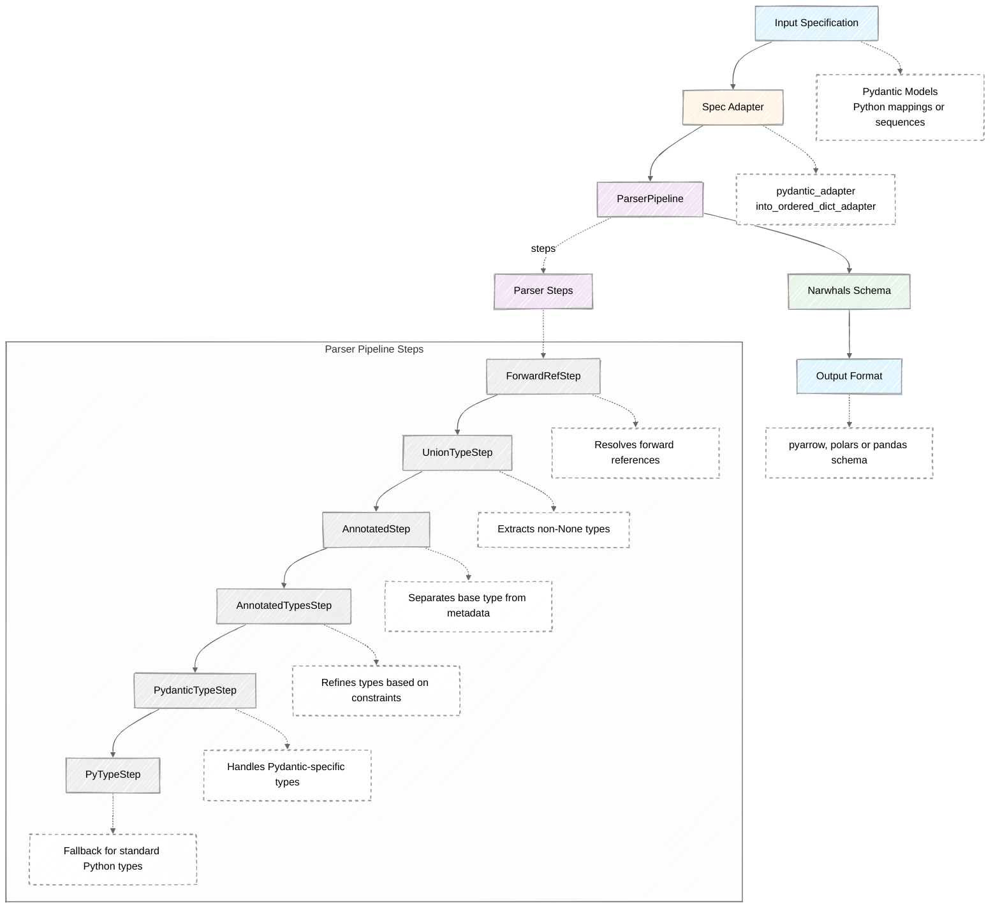

# Architecture

This page provides a deep dive into anyschema's internal design and architecture.
Understanding these concepts will help you extend anyschema and troubleshoot issues.

## Overview

anyschema follows a pipeline architecture with two main components:

1. **Spec Adapters**: Convert input specifications into a normalized format.
    For specifications supported directly by anyschema there is no need to create custom adapters.
2. **Parser Pipeline**: A sequence of parser steps that convert types into Narwhals dtypes.



## Core Components

### Spec Adapters

Spec adapters are functions that convert various input formats into a unified representation, namely an iterable of
`(field_name, field_type, metadata)` tuples.

See the [API Reference](api-reference/adapters.md) for detailed documentation.

### Parser Pipeline

The [`ParserPipeline`](api-reference/parsers.md#anyschema.parsers.ParserPipeline) orchestrates multiple parser steps, executing each step
in sequence until one successfully handles the type (or raises an error).

```python exec="true" source="above" result="python" session="parser-pipeline"
from anyschema.parsers import ParserPipeline, PyTypeStep

pipeline = ParserPipeline(steps=[PyTypeStep()])

dtype = pipeline.parse(int)
print(dtype)
```

### Parser Steps

Each parser step is responsible for handling specific type patterns.
Steps inherit from the [`ParserStep`](api-reference/parsers.md#anyschema.parsers.ParserStep) abstract base class.

| Step | Purpose | Handles | Order |
|------|---------|---------|-------|
| `ForwardRefStep` | Resolves forward references before any type inspection can happen | `ForwardRef('ClassName')` | Must be first |
| `UnionTypeStep` | Extracts non-None types from Optional/Union types (dataframe libraries don't have Union types) | `Union[T, None]`, `T \| None`, `Optional[T]` | Early - simplifies downstream parsers |
| `AnnotatedStep` | Separates base types from their constraints/metadata for independent processing | `Annotated[T, metadata1, ...]` | Before type-specific parsers |
| `AnnotatedTypesStep` | Refines types based on constraints (e.g., positive integers become unsigned types) | Types with `annotated_types` or Pydantic constraints | After `AnnotatedStep`, before type parsers |
| `PydanticTypeStep` | Handles Pydantic-specific types that need special processing beyond Python type inspection | Pydantic types like `FutureDate` | After metadata extraction, before fallback |
| `PyTypeStep` | Fallback parser for all standard Python types | Basic (`int`, `str`, `bool`), temporal (`date`, `datetime`), container (`list[T]`, `tuple[T, ...]`), other (`Decimal`, `Enum`) | Must be last |

### Parser Order and Rationale

The order of parsers is critical:

```python
steps = (
    ForwardRefStep(),  # 1. Resolve forward references first, before any type inspection
    UnionTypeStep(),  # 2. Extract non-None types from Optional/Union, it simplifies all downstream parsers
    AnnotatedStep(),  # 3. Extract metadata from Annotated, it should happen before type-specific logic
    AnnotatedTypesStep(),  # 4. Refine types based on metadata in `annotated_types` library
    PydanticTypeStep(),  # 5. Handle Pydantic-specific types before falling back to Python types
    PyTypeStep(),  # 6. The catch-all fallback for standard Python types
)
```

## Benefits of This Architecture

With this architecture we aim to achieve multiple goals at once:

* **Modularity**: Each parser has a single, well-defined responsibility.
* **Composability**: Parsers can be re-ordered, re-used, mixed and matched.
* **Extensibility**: New parsers can be added without modifying existing code.
* **Recursion Simplification**: Union/Optional extraction happens once, simplifying other parsers.
* **Metadata Flow**: Metadata is preserved and passed through the pipeline.

## Creating Custom Components

This architecture is designed to be easily extensible and customizable, both in terms of adding new parser steps and
creating custom adapters.

Learn how to extend `anyschema` with custom functionality. For more detailed examples, see the
[Advanced Usage](user-guide/advanced.md) guide.

## Metadata Preservation

Metadata flows through the pipeline:

```python
from typing import Annotated
from pydantic import BaseModel, Field, PositiveInt


class Product(BaseModel):
    quantity: PositiveInt  # PositiveInt is itself an Annotated type with constraints
```

The pipeline processes this as:

1. pydantic_adapter extracts: ("price", Annotated[float, Field(gt=0)], (FieldInfo,))
2. AnnotatedStep extracts: float with metadata (Field(gt=0), FieldInfo)
3. AnnotatedTypesStep refines based on constraints and converts to UInt64 (instead of Int64)

## Recursion and Nested Types

Parser steps can recursively call the pipeline for nested types:

```python
from anyschema import AnySchema
from pydantic import BaseModel


class Address(BaseModel):
    street: str
    city: str


class Person(BaseModel):
    name: str
    addresses: list[Address]  # Nested type!
```

Processing flow:

1. `pydantic_adapter` yields: `("addresses", list[Address], ())`
2. `PyTypeStep` sees `list[T]` and recursively calls: `pipeline.parse(Address, metadata=())`
3. The pipeline handles `Address` as a Pydantic model (which is considered a `Struct`)
4. Result: `List(Struct([('street', String), ('city', String)]))`

## Complete Flow Example

Let's trace a complete example through the system:

```python
from pydantic import BaseModel, PositiveInt
from anyschema import AnySchema


class Student(BaseModel):
    name: str
    age: PositiveInt
    classes: list[str] | None


schema = AnySchema(spec=Student)
```

Complete processing flow:

1. Spec Adapter: (`pydantic_adapter`):
    * Extracts: `("name", str, ())`
    * Extracts: `("age", PositiveInt, ())`
    * Extracts: `("classes", list[str] | None, ())`

2. Parser pipeline for `name: str`:
    * `ForwardRefStep`: Not a `ForwardRef` -> returns `None`
    * `UnionTypeStep`: Not a `Union` -> returns `None`
    * `AnnotatedStep`: Not `Annotated` -> returns `None`
    * `AnnotatedTypesStep`: No metadata -> returns `None`
    * `PydanticTypeStep`: Not a Pydantic type -> returns `None`
    * `PyTypeStep`: `str` -> returns `String()`
    * **Result**: `String()`

3. Parser pipeline for `age: PositiveInt`:
    * `ForwardRefStep`: Not a `ForwardRef` -> returns `None`
    * `UnionTypeStep`: Not a `Union` -> returns `None`
    * `AnnotatedStep`: `PositiveInt` is `Annotated[int, ...]` -> extracts `int` with metadata
    * Recursively parse `int` with metadata:

        * `AnnotatedTypesStep`: Metadata indicates positive constraint -> returns `UInt64()`
        * **Result**: `UInt64()`

4. Parse `classes: list[str] | None`:

    * `ForwardRefStep`: Not a `ForwardRef` -> returns `None`
    * `UnionTypeStep`: Is a `Union`! Extracts `list[str]` (non-None type)
    * Recursively parse `list[str]`:

        * `ForwardRefStep`: Not a `ForwardRef` -> returns `None`
        * `UnionTypeStep`: Not a `Union` -> returns `None`
        * `AnnotatedStep`: Not `Annotated` -> returns `None`
        * `AnnotatedTypesStep`: No metadata -> returns `None`
        * `PydanticTypeStep`: Not a Pydantic type -> returns `None`
        * `PyTypeStep`: `list[str]` -> recursively parse `str` (within the generic) -> returns `List(String())`
        * **Result**: `List(String())` (nullable)

5. **Final Schema**:

   ```python
   Schema({"name": String(), "age": UInt64(), "classes": List(String())})
   ```
